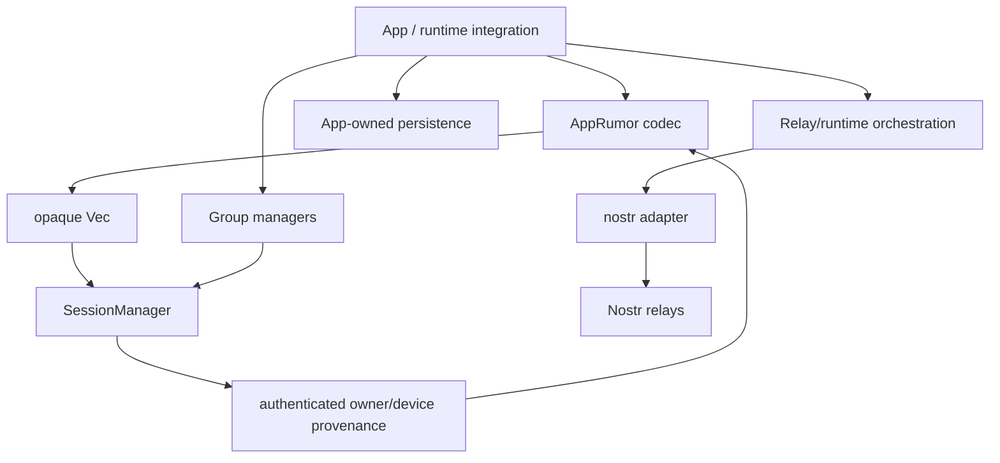
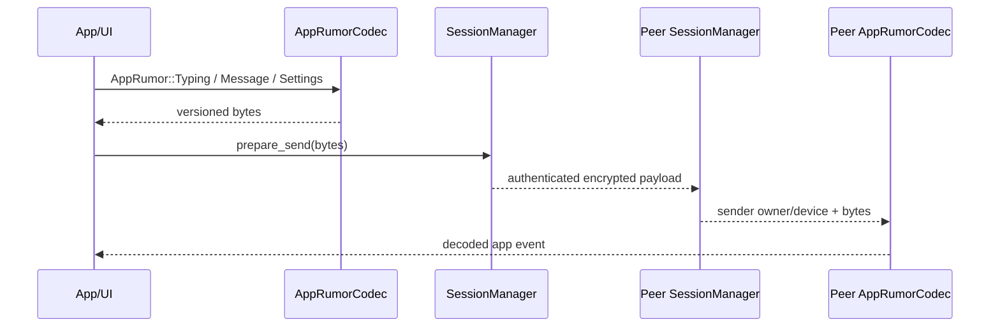
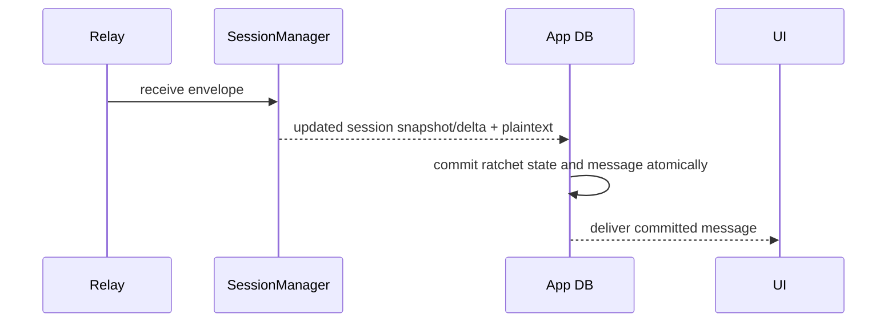
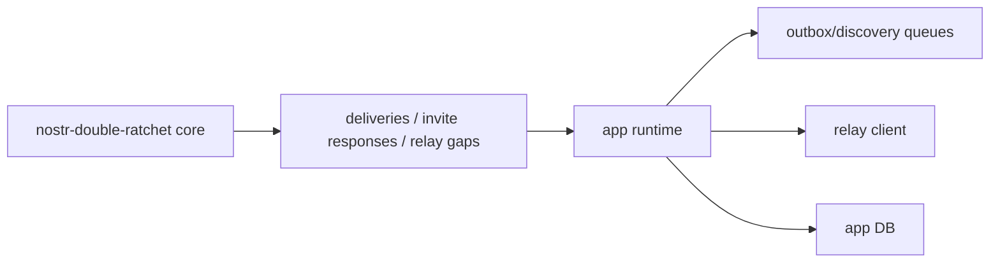
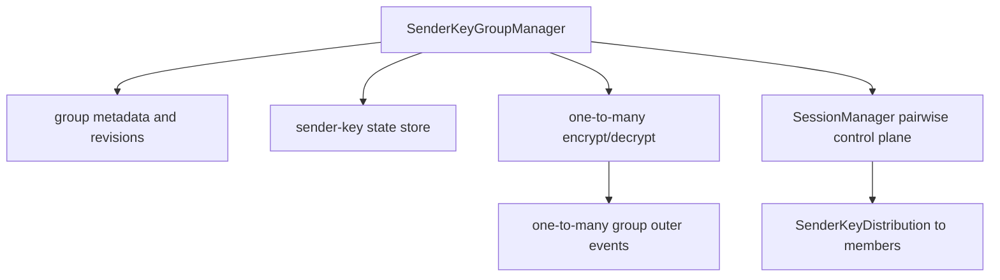

# Master Parity Roadmap

This document describes what the `experimental` implementation needs in order to reach behavioral
and wire-format parity with the current `htree/master` implementation while keeping the cleaner
domain architecture.

Parity here means:

- two implementations can exchange direct messages, invite flows, roster/AppKeys data, metadata
  events, and supported group messages
- the app can present the same feature set on top of either implementation
- persistence and restart behavior are equivalent from a product perspective

Parity does not mean copying the `htree/master` structure into `experimental`.

The intended direction is to keep `SessionManager` as an authenticated pairwise byte transport and
add clean modules above it for app payload semantics, runtime orchestration, persistence, and
sender-key groups.

## Current Direction



`experimental` should keep these boundaries:

- `Session` handles one device-to-device ratchet.
- `SessionManager` handles owner/device routing and authenticated pairwise payload transport.
- Payload semantics live outside `SessionManager`.
- Relay subscriptions, publishing, retries, and reconnects live outside the core crate.
- Persistence is app-owned, using snapshots first and deltas later if needed.
- Groups live above `SessionManager`, with pairwise fanout and sender-key modes selected by group
  protocol.

## Master Behaviors To Match

The current `htree/master` branch includes production-facing behavior that `experimental` does not
fully model yet:

- Nostr wire artifacts for AppKeys/rosters, invites, invite responses, direct messages, and group
  sender-key messages.
- Relay/runtime orchestration, including subscriptions and publish events.
- Automatic storage through a `StorageAdapter`.
- Persistent message and discovery queues.
- App-level metadata helpers for typing indicators, receipts, reactions, chat settings, and
  disappearing-message settings.
- Sender-key group messaging with one-to-many group message publishing.
- Group metadata and sender-key distribution over pairwise sessions.
- Pending event handling when a sender-key distribution arrives after the group message.

The parity goal is to provide equivalent behavior without folding those concerns into the
pairwise ratchet core.

## Direct Message Wire Parity

The Nostr adapter must keep the selected wire format stable:

- Session header JSON uses `number`, `previousChainLength`, and `nextPublicKey`.
- Owner trust lists use the legacy AppKeys replaceable identifier:
  `d=double-ratchet/app-keys`.
- Invite URLs use `inviter`, `ephemeralKey`, and `sharedSecret`.
- Invite events keep `d=double-ratchet/invites/...` and `l=double-ratchet/invites`.
- Direct-message outer events must preserve the same kind, header tag, content encoding, and
  signature authority expected by `master`.

`experimental` should keep the adapter responsible for this. The core crate should not learn about
Nostr event kinds or URL names.

Required work:

1. Keep adapter tests for each wire artifact.
2. Add cross-implementation fixture tests using serialized events from `master`.
3. Treat missing or unknown payload versions as hard errors in the app payload layer, not as
   compatibility fallbacks in `SessionManager`.

## App Rumor And Metadata Layer

Typing indicators, disappearing messages, reactions, receipts, deletes, and chat settings should
be implemented as an app-level payload codec above `SessionManager`.



Recommended shape:

```rust
pub enum AppRumor {
    Message {
        client_message_id: String,
        content: String,
    },
    Typing {
        conversation_id: String,
        expires_at: UnixSeconds,
    },
    Receipt {
        message_id: String,
    },
    Reaction {
        message_id: String,
        content: String,
    },
    Delete {
        message_id: String,
    },
    ChatSettings {
        message_ttl_seconds: Option<u64>,
    },
}
```

Important rules:

- The app event format must be explicitly versioned.
- `SessionManager` must not inspect the app event kind.
- Authenticated sender identity comes from `SessionManager::receive`, not from any inner `pubkey`
  field.
- If an inner Nostr-like rumor contains `pubkey`, it is metadata only unless the app deliberately
  defines additional validation.
- Ephemeral events such as typing indicators should normally not be queued for replay.
- Durable metadata such as disappearing-message settings should be persisted by the app in the same
  transaction as the received ratchet state.

Required work:

1. Define the versioned app rumor schema.
2. Implement encode/decode helpers outside `SessionManager`.
3. Map `master` metadata semantics to app events.
4. Add app-level tests for malformed versions, missing required fields, and authenticated
   provenance handling.

## Persistence Parity

`master` persists internally through a storage adapter. `experimental` currently exposes
`snapshot()` / `from_snapshot(...)` and expects the app to persist.

For parity, the app integration must persist after every state mutation:

- after `prepare_send(...)`
- after `receive(...)`
- after `observe_invite_response(...)`
- after `observe_device_invite(...)`
- after `apply_local_roster(...)`
- after `observe_peer_roster(...)`
- after `ensure_local_invite(...)`
- after group metadata or sender-key state changes

Correct receive ordering:



The first implementation can persist the full `SessionManagerSnapshot` and `GroupManagerSnapshot`
after every mutation. That is heavier than per-session writes but easier to make correct.

Later optimization should add explicit persistence deltas:

```rust
pub enum StateDelta {
    SessionManagerSnapshot(SessionManagerSnapshot),
    UserRecordUpdated { owner: OwnerPubkey },
    DeviceSessionUpdated {
        owner: OwnerPubkey,
        device: DevicePubkey,
    },
    GroupUpdated { group_id: String },
    SenderKeyUpdated {
        group_id: String,
        sender_device: DevicePubkey,
        key_id: u32,
    },
}
```

Required work:

1. Document the integration-side transaction rule.
2. Add restart tests that persist after every mutation and prove no new bootstrap is needed.
3. Add app-level persistence tests for crash points around receive and send.
4. Add a delta API only after snapshot persistence is proven correct.

## Runtime And Queue Parity

`master` owns relay subscription and queue behavior. `experimental` should keep this outside the
core crate.

The runtime layer should provide:

- latest AppKeys/roster fetch and subscription
- device invite fetch and subscription
- invite response subscription
- direct message subscription for current and next ratchet sender keys
- relay reconnect and resubscribe behavior
- message outbox and discovery queues
- retry policy and publish acknowledgement handling

Recommended split:



Required work:

1. Define a runtime contract around `PreparedSend`, `Delivery`, `InviteResponseEnvelope`, and
   `RelayGap`.
2. Persist outbox/discovery queues outside the core crate.
3. Replay queues after restart and after AppKeys/invite discovery.
4. Add relay-background/resume tests in the app or integration layer.

## Owner And Device Routing Parity

`experimental` already has the cleaner owner/device split:

- owner pubkeys identify accounts
- device pubkeys identify installations
- rosters/AppKeys authorize devices
- invite responses can carry owner claims
- unverified owner claims are staged until roster proof arrives

Parity work should focus on behavior:

- same AppKeys/roster replaceable event semantics
- same invite owner-claim verification result
- same migration of provisional device records after roster proof
- same local-sibling sync behavior
- same behavior when a device is revoked
- same hard failure behavior for malformed or stale trust-list state

Required work:

1. Add fixtures covering accepted, stale, malformed, and revoked AppKeys/roster events.
2. Add multi-device tests where sessions are first parked under provisional ownership and later
   migrated to the claimed owner.
3. Add tests proving revoked devices stop receiving new sends but can still decrypt already-sent
   delayed messages until local prune policy removes their state.

## Sender-Key Group Parity

`experimental` currently supports pairwise-fanout groups. To match `master`, add a sender-key group
protocol above `SessionManager`.

Do not replace `SessionManager`. Use it as the authenticated control plane.



Signal's sender-key model is the right shape:

- a sender key is unidirectional
- state is keyed by group plus sender/device identity
- a sender-key distribution message is sent to members before encrypted group messages can be
  decrypted
- group message decryption advances sender-key state and must be persisted before plaintext is
  delivered

For this crate, add a new protocol variant:

```rust
pub enum GroupProtocol {
    PairwiseFanoutV1,
    SenderKeyV1,
}
```

Suggested new state:

```rust
pub struct SenderKeyGroupSnapshot {
    pub group_id: String,
    pub protocol: GroupProtocol,
    pub metadata: GroupSnapshot,
    pub sender_keys: Vec<SenderKeyRecordSnapshot>,
    pub sender_event_mappings: Vec<SenderEventMapping>,
    pub pending_outer_events: Vec<PendingGroupOuterEvent>,
}
```

Required sender-key features:

- create or rotate local sender key state
- build sender-key distribution payloads
- distribute sender-key state through pairwise `SessionManager`
- publish one-to-many group messages with a sender event key
- map sender event pubkeys back to authenticated sender devices/owners
- queue one-to-many outer events until distribution state arrives
- rotate keys when membership changes
- persist sender-key state after every encrypt/decrypt
- reject group messages from inactive, revoked, or unmapped sender devices

Membership changes are the hard part. A sender-key group must rotate or replace sender keys when
members are removed so removed members cannot decrypt future messages.

## Group Metadata Parity

For pairwise-fanout groups, `experimental` already has a cleaner group metadata model:

- group membership is in owner pubkeys
- group control is revision-based
- admins are enforced in the core crate
- group payloads are versioned with `wire_format_version`

To reach full parity with `master`, group metadata should support:

- name
- description
- picture
- member list
- admin list
- accepted/removed local state if required by the app
- secret or sender-key bootstrap material only when required by the selected protocol
- explicit revision conflict behavior
- local sibling sync

The metadata shape should not depend on direct-message rumor internals.

## Compatibility Test Matrix

Parity should be proven with fixtures and integration tests, not assumed from similar code.

Minimum direct-message tests:

- `experimental` sends and `master` receives.
- `master` sends and `experimental` receives.
- both directions after app restart.
- both directions after relay reconnect/resubscribe.
- both directions with multiple devices per owner.
- stale or missing versioned app payload is rejected gracefully.

Minimum metadata tests:

- text message
- typing indicator
- disappearing-message setting
- read receipt
- reaction
- delete
- malformed version
- untrusted inner pubkey mismatch

Minimum group tests:

- create pairwise-fanout group.
- create sender-key group.
- distribute sender key over pairwise session.
- decrypt queued one-to-many message after distribution arrives.
- rotate sender key after membership removal.
- reject one-to-many message from unmapped sender event pubkey.
- restart after sender-key decrypt and continue decrypting the next message.

## Implementation Order

Recommended order:

1. Lock direct-message wire fixtures in the adapter.
2. Add `AppRumor` codec and metadata semantics above `SessionManager`.
3. Add explicit persistence guidance and restart tests for snapshots.
4. Build app/runtime queues outside the core crate.
5. Add sender-key primitives as pure domain types.
6. Add `GroupProtocol::SenderKeyV1`.
7. Add sender-key group manager snapshots.
8. Add cross-implementation fixtures against `master`.

This order keeps the core ratchet boundary clean while making each parity step testable.

## Non-Goals

- Do not make `SessionManager` parse typing indicators, reactions, or chat settings.
- Do not make `SessionManager` own relay subscriptions.
- Do not add a `StorageAdapter` to the core crate as the default persistence boundary.
- Do not trust inner rumor `pubkey` as sender authentication.
- Do not mix pairwise-fanout and sender-key group semantics under the same unversioned group
  protocol.
- Do not add silent backwards compatibility for removed or unknown wire formats.

## Open Decisions

These decisions must be made before claiming full parity:

- exact app rumor JSON schema
- whether direct app rumors should be Nostr-like unsigned events or a smaller app-specific format
- event kinds and tags for sender-key group messages
- whether sender event pubkeys are per group, per sender, or per sender-key epoch
- key rotation policy on member removal and device revocation
- whether queued typing indicators should be dropped instead of persisted
- snapshot-only persistence versus snapshot plus deltas
- where cross-implementation fixture tests should live
