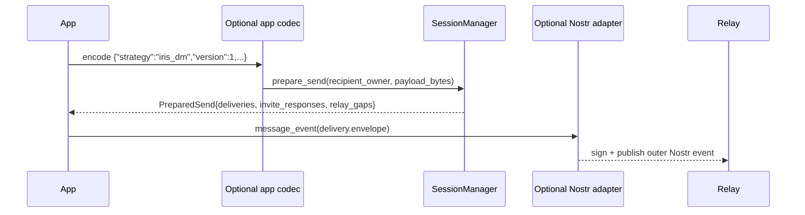

# `master` vs `experimental`

This document compares the current `master` architecture with the rewritten `experimental`
architecture.

The main conclusion is intentionally narrow:

- the rewrite is justified primarily as a boundary correction
- it is not justified primarily by style preferences such as "fewer `Arc`s" or "less async"

`master` already contains important behavior that `experimental` still needs to match. However, the
current `master` design places too many responsibilities in the protocol core:

- ratchet/session state
- Nostr wire format
- relay runtime and pubsub integration
- durable delivery queues
- app-level rumor semantics
- sender-key group side effects

`experimental` moves those concerns apart:

- the pairwise ratchet core owns explicit state transitions
- Nostr conversion is a sibling adapter concern
- app semantics are optional codecs layered above the core
- group strategy is expressed in wire-format modules above the core

For the current interop payload proposals that sit above the core, see
[./MASTER_PARITY.md](./MASTER_PARITY.md). For the current owner/device model, see
[./ARCHITECTURE.md](./ARCHITECTURE.md).
For the external Signal and sender-key references behind this comparison, see
[./PRIOR_WORK.md](./PRIOR_WORK.md).

## Executive Summary

`master` is ahead on integrated product behavior today, especially around linked-device bootstrap,
runtime queueing, and sender-key group handling. But it achieves that by widening the core boundary.
`Session` and `SessionManager` are not only managing pairwise cryptographic state; they also know
about Nostr `Event`s, relay subscription churn, queued `UnsignedEvent`s, chat-settings rumors, and
sender-key distribution side effects.

`experimental` is closer to the shape implied by Signal's Sesame session-management model and by
idiomatic Rust library design: the core exposes deterministic state transitions over explicit types,
while networking, storage, and product-specific codecs live above the core. That does not remove
the need to rebuild missing features, but it localizes future complexity in the right layers.

## Boundary Difference

### `master`

```mermaid
flowchart LR
  App["App-facing APIs<br/>text, typing, receipt, reaction, settings"] --> SM["SessionManager"]
  Relay["Nostr relay events"] --> Runtime["Runtime / PubSub"]
  Runtime --> SM
  SM --> Queue["Queued `UnsignedEvent` / `Event` state"]
  SM --> Settings["Chat-settings side effects"]
  SM --> SenderKey["Sender-key distribution and pending outer messages"]
  SM --> Session["`Session` on `nostr::Event` / `UnsignedEvent`"]
```

Evidence in `master`:

- `Session` itself is Nostr-shaped through `send_event(...)` and `receive(...)` in
  `rust/crates/nostr-double-ratchet/src/session.rs`.
- `SessionManager` ingests outer Nostr events via `process_received_event(...)` in
  `rust/crates/nostr-double-ratchet/src/session_manager/event_processing.rs`.
- app-level send helpers such as `send_text`, `send_typing`, `send_receipt`, `send_reaction`, and
  `send_chat_settings` live in `rust/crates/nostr-double-ratchet/src/session_manager/api.rs`.
- durable delivery queues store `UnsignedEvent`s in
  `rust/crates/nostr-double-ratchet/src/message_queue.rs`.
- chat settings are interpreted inside the core in
  `rust/crates/nostr-double-ratchet/src/session_manager/settings_storage.rs`.
- sender-key distribution and pending one-to-many delivery live in
  `rust/crates/nostr-double-ratchet/src/session_manager/group_sender_keys.rs`.

### `experimental`

```mermaid
flowchart LR
  App["App / integration"] --> Codec["Optional app codec"]
  App --> GroupCodec["Optional group codec"]
  App --> Adapter["Optional Nostr adapter / runtime"]
  Codec --> SM["SessionManager"]
  GroupCodec --> SM
  Adapter --> SM
  SM --> Session["`Session` on `MessageEnvelope` + opaque bytes"]
```

Evidence in `experimental`:

- `Session` exposes `plan_send(...)`, `apply_send(...)`, `plan_receive(...)`, and
  `apply_receive(...)` in [`../src/session.rs`](../src/session.rs).
- `SessionManager` consumes rosters, invites, invite responses, and `MessageEnvelope`s, and returns
  `PreparedSend` in [`../src/session_manager.rs`](../src/session_manager.rs).
- Nostr conversions live in the sibling adapter crate
  `rust/crates/nostr-double-ratchet-nostr/src/nostr.rs`.
- the optional wire/codecs direction is documented in [./MASTER_PARITY.md](./MASTER_PARITY.md).

## Direct-Message Flow Difference



This difference matters because it determines where interoperability logic lives:

- in `master`, the core owns much of the direct-message rumor semantics
- in `experimental`, the core authenticates and transports bytes, while the codec remains optional

That optionality is important for reuse. A caller should be able to:

1. send arbitrary bytes over the pairwise ratchet
2. import the Iris-compatible codec for interop
3. layer a different app protocol on the same transport core

## Comparison Table

| Topic | `master` | `experimental` | Evaluation |
|---|---|---|---|
| Core session API | `Session` consumes and emits Nostr-shaped values in `session.rs`. | `Session` operates on `MessageEnvelope` and opaque bytes in [`../src/session.rs`](../src/session.rs). | `experimental` has the cleaner cryptographic boundary. |
| Outer wire format | Owned largely inside `SessionManager` and related runtime modules. | Owned by `nostr-double-ratchet-nostr` plus optional codecs above core. | Strong point in favor of the rewrite. |
| App semantics | Text, typing, receipts, reactions, and chat settings are wired into core send/receive paths. | App semantics are intended to live in optional codecs above `SessionManager`. | Better separation in `experimental`, but convenience wrappers still need to be rebuilt. |
| Queue/runtime behavior | Pubsub, retries, delivery queues, and subscription throttling are core-adjacent correctness mechanisms. | Core is synchronous/deterministic; runtime behavior is meant to live above it. | Better long-term layering in `experimental`; `master` is ahead on shipped behavior. |
| Group strategy identity | Current `master` behavior mixes pairwise control and sender-key outer flows inside the core. | Group strategy/version is being made explicit above core. | `experimental` is directionally better, but not finished yet. |
| Ownership/concurrency | Heavy use of shared mutable state inside the protocol crate. | Core ownership is local and explicit. | Strong point in favor of the rewrite. |
| Testing surface | Broad end-to-end behavior exists, but much of it depends on integrated runtime behavior. | Narrower unit and state-machine tests are easier to write around explicit inputs/outputs. | `experimental` is better for precise protocol testing. |

## Evaluation Of The Main Design Claims

### 1. The protocol core should be deterministic and mostly synchronous

Why this helps:

- Signal's [Sesame specification](https://signal.org/docs/specifications/sesame/sesame.pdf)
  describes device state, active/inactive session selection, stale-device handling, and
  send/receive behavior as explicit state-machine logic.
- `experimental` matches that model well: `Session` has plan/apply operations and `SessionManager`
  has call/return APIs over explicit domain types.
- This makes replay, promotion, stale-record behavior, and send-target selection easier to test in
  isolation.

Counterpoint:

- "Synchronous" should not be interpreted as "no async anywhere." Signal's
  [libsignal](https://github.com/signalapp/libsignal) uses async store-backed APIs in modern Rust
  code, including sender-key handling.
- The stronger requirement is that the protocol state machine be deterministic. Storage, relay I/O,
  and background workers can remain async at the integration boundary.

Verdict:

- keep the core deterministic and explicit
- do not turn "no async" into an ideological goal

### 2. The core should not own the Nostr wire format

Why this helps:

- In `master`, Nostr event structure is not just an adapter concern. It is embedded in `Session`,
  `SessionManager`, queues, and runtime modules.
- This makes the core harder to reuse, harder to test without Nostr fixtures, and harder to evolve
  when app-level payload semantics change.
- Rust's [API Guidelines: Dependability](https://rust-lang.github.io/api-guidelines/dependability.html)
  recommend pushing validation and structure to the boundaries. Optional codecs above the core fit
  that model better than liberal parsing inside the ratchet layer.

Counterpoint:

- A batteries-included integration API is useful. `master` is easier to drop into one specific app
  because it already bundles convenience behavior.
- If Iris is the only consumer, an optional codec layer can feel like extra work unless it is
  packaged well.

Verdict:

- move wire and app codec logic out of the core
- keep convenience crates so integrators can still opt into the existing behavior

### 3. The core should have clear ownership instead of shared mutable orchestration

Why this helps:

- Rust's [shared-state concurrency chapter](https://doc.rust-lang.org/stable/book/ch16-03-shared-state.html)
  treats locking as a real coordination mechanism, not a free abstraction.
- The [`Arc` documentation](https://doc.rust-lang.org/std/sync/struct.Arc.html) is explicit that
  `Arc<T>` provides shared ownership, and mutable access through `Arc` generally requires
  additional synchronization such as `Mutex`.
- In local source-only checks, `master` contains roughly 135 `Arc` or `Mutex` references under
  `rust/crates/nostr-double-ratchet/src`, while `experimental` has none in core logic; the only
  two matches are string literals in [`../src/lib.rs`](../src/lib.rs).
- `experimental` keeps mutable state local to `Session` and `SessionManager`, which makes ownership
  and mutation sites far easier to audit.

Counterpoint:

- `Arc` and `Mutex` are legitimate tools at FFI and runtime boundaries. That part is not a design
  flaw by itself.
- The correct objection is not "shared-state primitives exist" but "the protocol core depends on
  them pervasively."

Verdict:

- keep shared-state orchestration out of the ratchet core
- allow it where needed at the outer runtime and FFI layers

### 4. Group protocols should declare both strategy and version

Why this helps:

- Signal's [2014 private group messaging write-up](https://signal.org/blog/private-groups/) explains
  the simplicity of pairwise fanout and its sender-side `N`-message cost.
- Sender-key messaging is a different compatibility class from pairwise fanout. It is not just
  another revision of the same wire family.
- A descriptor such as `{"strategy":"sender_key","version":1}` is clearer than a single flattened
  enum label, especially when both pairwise and sender-key strategies may coexist over time.

Counterpoint:

- `experimental` is not fully there yet. `GroupProtocol::PairwiseFanoutV1` in [`../src/group.rs`](../src/group.rs)
  still bakes strategy and version together, so this is partly an argument for continuing the
  rewrite rather than an already-finished result.
- More explicit wire identities mean migration code and compatibility handling must also be
  explicit.

Verdict:

- separate strategy from version in the group wire contract
- keep sender-key distribution and outer group-message formats above `SessionManager`

## Why This Favors A Rewrite Instead Of Only Hardening `master`

The case for the rewrite is strongest when framed as a structural problem:

1. In `master`, the boundary problem is not confined to one helper module. `Session` itself is
   Nostr-shaped, so the wire-format dependency reaches down to the lowest transport layer.
2. `SessionManager` in `master` contains product semantics such as chat-settings handling and
   sender-key distribution side effects. Extracting those later is possible, but it is not a
   cosmetic cleanup.
3. Delivery correctness in `master` depends on intertwined runtime behaviors such as queueing,
   retries, bootstrap scheduling, and subscription refreshes.
4. `experimental` already demonstrates that the pairwise core can be expressed as a narrower domain
   layer with explicit inputs and outputs.

This does not mean `master` cannot be improved incrementally. It means incremental hardening and
incremental convergence to the desired boundary are two different tasks. The first is straightforward.
The second is likely to keep fighting the existing structure.

## Arguments Against The Rewrite

The rewrite still has real costs. A balanced decision should keep them visible.

- `master` already contains linked-device and delivery behavior that matters in practice, including
  queue cleanup on revocation, delayed bootstrap flushing, response-only session upgrades, and
  restart-sensitive delivery recovery. Those behaviors are tested today in
  `rust/crates/nostr-double-ratchet/tests/session_manager_multi_device_test.rs` and
  `rust/crates/nostr-double-ratchet/src/session_manager/tests.rs`.
- Splitting codecs and runtime logic out of the core changes the integration experience. Callers
  need a good optional adapter/codec layer or they will lose ergonomics even if the architecture
  is cleaner.
- `experimental` still needs feature work for sender-key groups and some linked-device/runtime
  parity, so the rewrite path is not "free simplification." It is an explicit migration program.

Those are real objections. They argue for a compatibility layer and a staged migration plan, not
for preserving the current core boundary forever.

## Recommended Direction

If the goal is long-term maintainability and a Rust-native core, prefer `experimental` as the
architectural target.

If the goal is near-term product continuity, provide optional compatibility modules on top of that
core:

- a Nostr adapter/runtime crate
- an Iris-compatible pairwise app codec
- a sender-key group codec/runtime layer
- convenience wrappers that preserve the current integration ergonomics where needed

That strategy preserves the practical strengths of `master` without locking the protocol core to
the current boundary.

## Sources

External references:

- [Signal Sesame specification](https://signal.org/docs/specifications/sesame/sesame.pdf)
- [Signal: Private Group Messaging](https://signal.org/blog/private-groups/)
- [Signal: A Synchronized Start for Linked Devices](https://signal.org/blog/a-synchronized-start-for-linked-devices/)
- [Signal libsignal repository](https://github.com/signalapp/libsignal)
- [Signal libsignal sender-key implementation](https://github.com/signalapp/libsignal/blob/main/rust/protocol/src/group_cipher.rs)
- [Rust Book: Shared-State Concurrency](https://doc.rust-lang.org/stable/book/ch16-03-shared-state.html)
- [`std::sync::Arc` documentation](https://doc.rust-lang.org/std/sync/struct.Arc.html)
- [Rust API Guidelines: Dependability](https://rust-lang.github.io/api-guidelines/dependability.html)
- [Rust API Guidelines: Flexibility](https://rust-lang.github.io/api-guidelines/flexibility.html)

Local evidence in this workspace:

- `master`: `rust/crates/nostr-double-ratchet/src/session.rs`
- `master`: `rust/crates/nostr-double-ratchet/src/session_manager.rs`
- `master`: `rust/crates/nostr-double-ratchet/src/session_manager/event_processing.rs`
- `master`: `rust/crates/nostr-double-ratchet/src/session_manager/api.rs`
- `master`: `rust/crates/nostr-double-ratchet/src/session_manager/settings_storage.rs`
- `master`: `rust/crates/nostr-double-ratchet/src/session_manager/group_sender_keys.rs`
- `master`: `rust/crates/nostr-double-ratchet/src/message_queue.rs`
- `master`: `rust/crates/nostr-double-ratchet/src/runtime.rs`
- `master`: `rust/crates/nostr-double-ratchet/tests/session_manager_multi_device_test.rs`
- `experimental`: [`../src/session.rs`](../src/session.rs)
- `experimental`: [`../src/session_manager.rs`](../src/session_manager.rs)
- `experimental`: `rust/crates/nostr-double-ratchet-nostr/src/nostr.rs`
- `experimental`: [./MASTER_PARITY.md](./MASTER_PARITY.md)
- `experimental`: [./ARCHITECTURE.md](./ARCHITECTURE.md)
