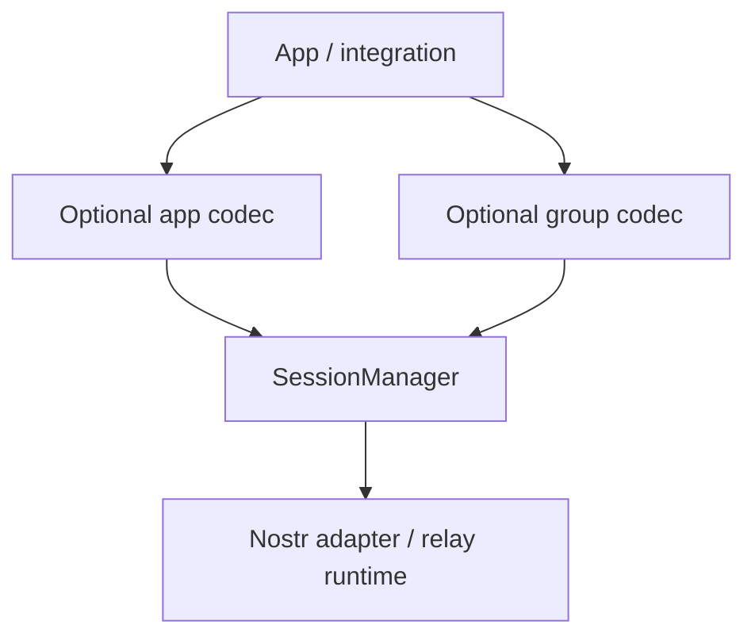

# Interop Formats

This document defines the compatibility formats that sit above the core ratchet.

The core rule is:

- `SessionManager` transports authenticated bytes between owners and devices.
- It does not need to know chat-message structure, typing semantics, receipts, reactions, or group
  strategy details.
- Those concerns belong in optional codec modules on top of the core crate.

`master` originally placed much of this logic inside `SessionManager`. The direction here is to keep
the core smaller and move product-specific wire formats into reusable modules that callers may adopt
or ignore.

## Layering



`SessionManager` accepts and returns opaque bytes.

If a caller wants Iris-compatible semantics, it can import the codec module documented here. If not,
it can define any payload format it wants and still use the same ratchet core.

## Optional Pairwise App Codec

### Why it exists

In `master`, direct-message payload semantics were effectively built into the transport layer:

- chat messages
- typing indicators
- delivered / seen receipts
- reactions
- chat settings

That made interop easy, but it coupled product behavior to the ratchet core.

The new design keeps the same payload format available, but as an optional codec above
`SessionManager`.

This section describes the inner payload format carried by `SessionManager`. The outer Nostr event
shape remains an adapter concern.

### Codec contract

Recommended top-level format:

```json
{
  "strategy": "iris_dm",
  "version": 1,
  "kind": "message",
  "client_message_id": "01J...",
  "content": "hello"
}
```

The important rule is that `strategy` and `version` are separate fields.

- `strategy` identifies the semantic family.
- `version` identifies the schema version inside that family.

Do not overload `version` to also mean strategy.

### Supported `iris_dm` message kinds

`message`

```json
{
  "strategy": "iris_dm",
  "version": 1,
  "kind": "message",
  "client_message_id": "01J...",
  "content": "hello"
}
```

`typing`

```json
{
  "strategy": "iris_dm",
  "version": 1,
  "kind": "typing",
  "conversation_id": "npub1...",
  "expires_at": 1800000000
}
```

`receipt`

```json
{
  "strategy": "iris_dm",
  "version": 1,
  "kind": "receipt",
  "receipt_type": "delivered",
  "message_ids": ["event-id-1", "event-id-2"]
}
```

`reaction`

```json
{
  "strategy": "iris_dm",
  "version": 1,
  "kind": "reaction",
  "message_id": "event-id-1",
  "content": "👍"
}
```

`chat_settings`

```json
{
  "strategy": "iris_dm",
  "version": 1,
  "kind": "chat_settings",
  "message_ttl_seconds": 86400
}
```

### Decoder rules

- The authenticated sender comes from `SessionManager::receive`, not from any field inside the
  payload.
- Unknown `strategy` values are not a ratchet error. They mean the caller chose a different app
  format.
- Unknown `version` values inside a recognized `strategy` are codec errors.
- Ephemeral messages such as `typing` should normally not be replayed from durable queues.
- Durable metadata such as `chat_settings` should be persisted by the integration layer in the same
  transaction as the updated ratchet state.

### Optionality

This codec is optional by design.

Callers have three choices:

1. Send arbitrary bytes and define their own app protocol.
2. Import this codec and interoperate with the Iris direct-message format.
3. Wrap this codec in a larger app protocol if they need additional message kinds.

## Group Protocol Identity

Groups should identify their protocol with a structured descriptor:

```json
{
  "strategy": "pairwise_fanout",
  "version": 1
}
```

or:

```json
{
  "strategy": "sender_key",
  "version": 1
}
```

This replaces names that bake strategy and version into one enum label.

Recommended meanings:

- `pairwise_fanout` / `1`: every group payload is sent over pairwise sessions to each member.
- `sender_key` / `1`: control-plane messages use pairwise sessions, while group chat payloads use a
  sender-key one-to-many outer format.

Do not mix multiple strategies under the same unqualified group protocol identity.

## Sender-Key Group Format

### Model

Sender-key groups should use:

- pairwise `SessionManager` traffic for control-plane messages
- one-to-many outer events for group payloads
- a per-group protocol descriptor of `{"strategy":"sender_key","version":1}`

The ratchet core remains the authenticated pairwise transport for:

- sender-key distribution
- membership changes
- metadata updates that require authenticated device attribution

### Distribution payload

Recommended pairwise control payload:

```json
{
  "strategy": "sender_key_distribution",
  "version": 1,
  "group_id": "group-123",
  "key_id": 7,
  "sender_event_pubkey": "npub1...",
  "chain_key": "base64...",
  "iteration": 0
}
```

Properties:

- sent over a normal pairwise session
- authenticated by `SessionManager`
- identifies the sender event pubkey that will author one-to-many outer group messages

### Outer group payload

Recommended one-to-many outer payload:

```json
{
  "strategy": "sender_key",
  "version": 1,
  "group_id": "group-123",
  "sender_event_pubkey": "npub1...",
  "key_id": 7,
  "message_number": 42,
  "ciphertext": "base64..."
}
```

The plaintext inside `ciphertext` may itself be any app-defined group payload. For Iris-compatible
group chat, that should be a separate optional app/group codec, not hard-coded into
`SessionManager`.

The exact Nostr event kind, tags, and signing authority for these group messages remain adapter
details layered around this protocol payload.

### Sender-key rules

- Sender-key state is keyed by group plus sender device identity.
- The mapping from `sender_event_pubkey` to sender owner/device must come from authenticated
  pairwise distribution, not from trusting the outer event alone.
- If a group outer message arrives before its distribution, queue it until the required sender-key
  state exists.
- Persist sender-key state after every encrypt/decrypt step before delivering plaintext upward.
- Rotate sender-key state when membership changes.
- Reject group messages from revoked, inactive, or unmapped sender devices.

## What the Core Owns

The core crate should continue owning:

- pairwise ratchet state
- owner/device authorization state
- invite acceptance and invite-response processing
- authenticated sender provenance
- snapshots for persistence

It should not need to own:

- chat message schema
- typing / receipt / reaction semantics
- direct-message app rumor parsing
- sender-key group payload schema
- relay subscription policy
- outbox/discovery queue policy

That split keeps the Rust core small while still allowing a shared interop format for callers that
want it.
